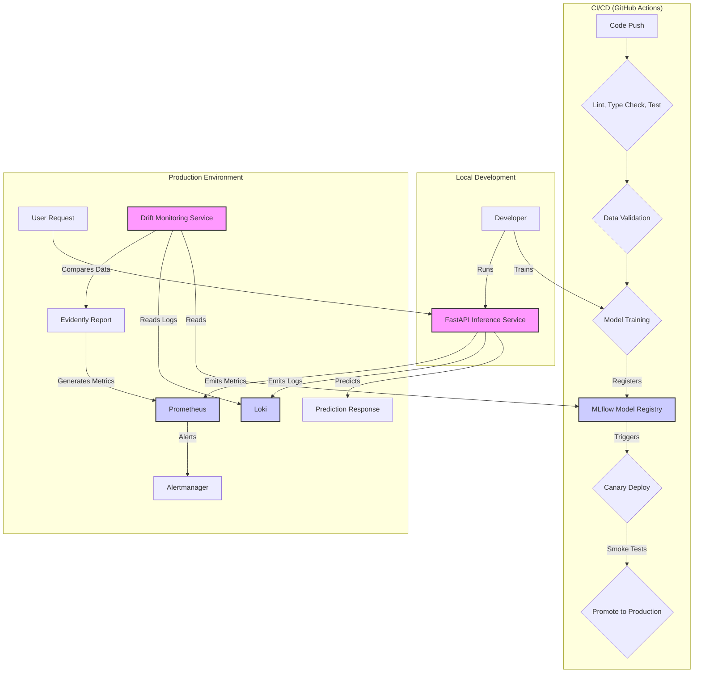

# ml-cicd-pipeline

This repository provides an enterprise-ready CI/CD blueprint for machine learning services. It demonstrates how to move a model from experimentation to production with reproducible assets, automated quality gates, and observable runtime behavior across both Windows and Linux environments.

## Purpose

The main goal of this project is to provide a complete, end-to-end example of a production-ready machine learning service. This includes not only the model training and inference code, but also the surrounding infrastructure, such as:

*   **CI/CD pipelines:** Automated workflows for testing, building, and deploying the service.
*   **Infrastructure as Code (IaC):**  Terraform and Helm charts for provisioning and managing the required infrastructure.
*   **Monitoring and alerting:**  Prometheus and Grafana for monitoring the service's health and performance, and for sending alerts when issues are detected.
*   **Drift detection:**  A dedicated service for detecting and reporting data and model drift.

By providing a complete and well-documented example, this project aims to help developers and organizations build and deploy their own machine learning services more effectively.

## Features

- **End-to-End Workflow:** Covers data validation, training, packaging, deployment, and post-deployment gating in a single, cohesive project.
- **Platform Agnostic:** Offers first-class support for Windows (via PowerShell) and Linux/macOS, plus containerized delivery.
- **Production Guardrails:** Implements GitHub Actions pipelines to enforce linting, type checking, testing, data validation, model metric thresholds, and canary promotion rules.
- **Operational Clarity:** Includes runbooks, policy documents, and monitoring manifests that reflect the real-world challenges of ML operations.

## Architecture

The following diagram illustrates the high-level architecture of the MLOps pipeline:



## Quick Start

### Prerequisites

- Python 3.11
- Poetry 1.5+ (or `pip` with `pyproject.toml`)
- Docker, `kubectl`, and `helm` for containerized and Kubernetes workflows.

### Installation

1.  **Clone the repository:**
    
    git clone https://github.com/your-username/ml-cicd-pipeline.git
    cd ml-cicd-pipeline
    2.  **Install dependencies:**
    -   **Windows:**
        
        Set-ExecutionPolicy -Scope CurrentUser RemoteSigned
        .\scripts\windows\setup.ps1
            -   **macOS/Linux:**
     
        pip install poetry
        poetry install
        3.  **Produce Artefacts & Run Service:**
    1. Generate or copy datasets into `data/processed/` (satisfies validation tests).
    2. Point `MLFLOW_TRACKING_URI` (and optionally `MLFLOW_MODEL_NAME`, `MLFLOW_EXPERIMENT_NAME`) at your tracking server, then train and register a model: `poetry run python -m src.models.trainer`
       - Add `--output <path>` if you also want a local artefact for ad-hoc testing.
       - Model hyperparameters can be configured via environment variables: `MODEL_N_ESTIMATORS` (default: 10), `MODEL_RANDOM_STATE` (default: 42), `MODEL_TEST_SIZE` (default: 0.2)
    3. Start the API locally: `poetry run uvicorn src.app.main:app --reload --host 0.0.0.0 --port 8000`
    4. Validate via `GET /health/`, `POST /predict/`, and `GET /metrics/` (the health payload now includes an `mlflow` diagnostic block covering reachability and server version).

    Containerised option: `MLFLOW_TRACKING_URI=http://localhost:5000 MLFLOW_MODEL_NAME=iris-random-forest MLFLOW_MODEL_STAGE=Production MODEL_AUTO_REFRESH_SECONDS=300 ADMIN_API_TOKEN=dev-admin-token docker compose up --build` starts the API with runtime model downloads and exposes port `8000`—replace the token before exposing the deployment beyond local development. If your MLflow instance requires authentication, also pass `MLFLOW_TRACKING_USERNAME` and `MLFLOW_TRACKING_PASSWORD` (or configure the Helm chart secrets).

### Usage

1.  **Train a model:**sh
    poetry run python -m src.models.trainer --output model.pkl
        **Model Training Configuration:**
    
    The training script supports the following environment variables to configure model hyperparameters:
    
    - `MODEL_N_ESTIMATORS` (default: `10`): Number of trees in the RandomForestClassifier
    - `MODEL_RANDOM_STATE` (default: `42`): Random seed for reproducibility in train/test split and model initialization
    - `MODEL_TEST_SIZE` (default: `0.2`): Proportion of dataset to include in the test split (0.0 to 1.0)
    
    Example:
    
    MODEL_N_ESTIMATORS=100 MODEL_RANDOM_STATE=42 MODEL_TEST_SIZE=0.2 poetry run python -m src.models.trainer --output model.pkl
    2.  **Run the API locally:**sh
    poetry run uvicorn src.app.main:app --reload --host 0.0.0.0 --port 8000
    
3.  **Test the API:**
    -   **Health Check:** `GET http://localhost:8000/health/`
    -   **Prediction:** `POST http://localhost:8000/predict/` with a JSON body like `{"features": [[1, 2, 3, 4]]}`
    -   **Metrics:** `GET http://localhost:8000/metrics/`

## Configuration

The service can be configured using environment variables with comprehensive validation and sensible defaults. Configuration is managed using Pydantic BaseSettings, ensuring type safety and fail-fast behavior for misconfigurations.

### Quick Configuration Guide

**Required variables by MODEL_SOURCE:**

- **When `MODEL_SOURCE=mlflow`**: `MLFLOW_MODEL_NAME`, `MLFLOW_TRACKING_URI`
- **When `MODEL_SOURCE=local`**: `MODEL_PATH` (must exist)
- **Always required**: `ADMIN_API_TOKEN` (for admin endpoints)

**Key variables:**

*   `MODEL_SOURCE`: The source of the model. Can be `local` or `mlflow`. Defaults to `mlflow`.
*   `MODEL_PATH`: The local path to the model file. Only used if `MODEL_SOURCE` is `local`. Defaults to `/app/model/model/model.pkl` (configurable via `MODEL_BASE_DIR`).
*   `MLFLOW_TRACKING_URI`: The URI of the MLflow tracking server (required if `MODEL_SOURCE=mlflow`).
*   `MLFLOW_MODEL_NAME`: The name of the model in the MLflow model registry (required if `MODEL_SOURCE=mlflow`).
*   `MLFLOW_MODEL_STAGE`: The stage of the model in the MLflow model registry. Defaults to `Production`.
*   `MODEL_AUTO_REFRESH_SECONDS`: Interval in seconds for auto-refreshing the model. Defaults to `300` (5 minutes). Set to `0` to disable.
*   `EXPECTED_FEATURE_DIMENSION`: The expected number of input features for the model. Defaults to `4` (for Iris dataset). This value is automatically derived from the loaded model metadata at startup.
*   `LOG_LEVEL`: The logging level. Defaults to `INFO`.
*   `LOG_FORMAT`: The log format. Can be `json` or `text`. Defaults to `json`.

For a complete reference of all configuration variables, validation rules, and examples, see **[docs/CONFIGURATION.md](docs/CONFIGURATION.md)**.

## Testing

To run the tests, use the following command:

```sh
poetry run pytest
```

The tests are located in the `tests/` directory and are written using the `pytest` framework. The tests cover both the model training and inference code, as well as the API endpoints.

## Project Structure

-   `ci/`: Policy guidance and runbooks for the automated workflows.
-   `docs/`: In-depth documentation, including architecture and setup guides.
-   `infra/`: Infrastructure-as-code, including Helm charts for Kubernetes deployments and Prometheus monitoring manifests.
-   `notebooks/`: Jupyter notebooks for experimentation and analysis.
-   `scripts/`: Automation scripts for CI, Windows setup, and canary promotions.
-   `src/`: The main source code for the application.
    -   `app/`: The FastAPI application, including routers, configuration, and the main entry point.
    -   `models/`: Scripts for model training and inference.
    -   `utils/`: Utility modules for telemetry, logging, drift detection, and tracing.
-   `tests/`: Unit and integration tests for the application.
-   `.github/`: GitHub Actions workflow definitions.

## CI/CD Highlights

- **Lint, type, test** (`.github/workflows/ci-lint-test.yml`): Runs Ruff, MyPy, and pytest across Linux and Windows runners.
- **Data validation** (`data-validation.yml`): Executes validators when data assets change to catch schema drifts early.
- **Model training** (`model-training.yml`): Automates model retraining against MLflow, registers a new version, and surfaces the resulting `MODEL_URI` for downstream automation.
- **Canary deploy & promote** (`deploy-canary-and-promote.yml`): Reacts to MLflow `repository_dispatch` events (or manual triggers), builds/pushes images, derives runtime configuration from the supplied `MODEL_URI` (model name/stage), deploys a Helm canary, runs smoke tests, evaluates `ml_model_accuracy ≥ 0.70`, and promotes or rolls back accordingly.

## Drift Monitoring

This project includes a comprehensive drift monitoring and feedback loop system:

-   **Reference Snapshot:** The training script (`src/models/trainer.py`) persists the training dataset to a specified location. This snapshot serves as a baseline for drift detection.
-   **Production Telemetry:** The `/predict` endpoint emits structured JSON logs containing features, predictions, and metadata. These logs can be shipped to a log analysis service (e.g., Loki) to create a "current" dataset for drift analysis.
-   **Evidently Service:** A dedicated FastAPI service (`src/drift_monitoring/`) periodically compares the reference and production datasets using Evidently. It exports Prometheus gauges that track data drift, feature-level drift, and prediction PSI.
-   **Alerting:** The Prometheus monitoring setup includes recording rules that trigger alerts (`DataDriftDetected`, `HighPredictionPSI`) when significant drift is detected.

## Further Reading

-   **`docs/ARCHITECTURE.md`:** A detailed overview of the project's architecture and component responsibilities.
-   **`docs/SET-UP.md`:** Platform-specific setup instructions, environment configuration, and deployment guides.
-   **`API_DOCUMENTATION.md`:** A complete catalog of the API endpoints and their usage.
