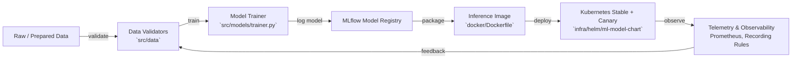

# ml-cicd-pipeline

Enterprise-ready CI/CD blueprint for machine learning services. This repository demonstrates how to move a model from experimentation to production with reproducible assets, automated quality gates, and observable runtime behaviour across Windows and Linux environments.

## Why This Repository?

- **End-to-end workflow**: Covers data validation, training, packaging, deployment, and post-deploy gating in a single project.
- **Platform agnostic**: First-class support for Windows (PowerShell) and Linux/macOS shells, plus containerised delivery.
- **Production guardrails**: GitHub Actions pipelines enforce linting, typing, testing, data checks, model metrics thresholds, and canary promotion rules.
- **Operational clarity**: Runbooks, policy docs, and monitoring manifests reflect the day-two realities of ML operations.

## Reference Architecture

The inference surface is implemented with FastAPI (`src/app`), instrumented via Prometheus middleware (`src/utils/telemetry.py`), and fronted by Helm-managed stable/canary deployments. Deployments are gated on live metrics before promotion.

## Quick Start

### 1. Provision Tooling
- Python **3.11**
- Poetry 1.5+ (preferred) or virtualenv + `requirements.txt`
- Docker, kubectl, Helm (for container and cluster workflows)

### 2. Bootstrap Environment
- **Windows**: `Set-ExecutionPolicy -Scope CurrentUser RemoteSigned` then run `.\scripts\windows\setup.ps1`
- **macOS/Linux**: `python -m pip install --upgrade pip && pip install poetry && poetry install`

See `docs/SET-UP.md` for detailed instructions, environment variables, and platform nuances.

### 3. Produce Artefacts & Run Service
1. Generate or copy datasets into `data/processed/` (satisfies validation tests).
2. Point `MLFLOW_TRACKING_URI` (and optionally `MLFLOW_MODEL_NAME`, `MLFLOW_EXPERIMENT_NAME`) at your tracking server, then train and register a model: `poetry run python -m src.models.trainer`
   - Add `--output <path>` if you also want a local artefact for ad-hoc testing.
3. Start the API locally: `poetry run uvicorn src.app.main:app --reload --host 0.0.0.0 --port 8000`
4. Validate via `GET /health/`, `POST /predict/`, and `GET /metrics/` (the health payload now includes an `mlflow` diagnostic block covering reachability and server version).

Containerised option: `MLFLOW_TRACKING_URI=http://localhost:5000 MLFLOW_MODEL_NAME=iris-random-forest MLFLOW_MODEL_STAGE=Production MODEL_AUTO_REFRESH_SECONDS=300 ADMIN_API_TOKEN=dev-admin-token docker compose up --build` starts the API with runtime model downloads and exposes port `8000`—replace the token before exposing the deployment beyond local development. If your MLflow instance requires authentication, also pass `MLFLOW_TRACKING_USERNAME` and `MLFLOW_TRACKING_PASSWORD` (or configure the Helm chart secrets).

## CI/CD Highlights

- **Lint, type, test** (`.github/workflows/ci-lint-test.yml`): Runs Ruff, MyPy, and pytest across Linux and Windows runners.
- **Data validation** (`data-validation.yml`): Executes validators when data assets change to catch schema drifts early.
- **Model training** (`model-training.yml`): Automates model retraining against MLflow, registers a new version, and surfaces the resulting `MODEL_URI` for downstream automation.
- **Canary deploy & promote** (`deploy-canary-and-promote.yml`): Reacts to MLflow `repository_dispatch` events (or manual triggers), builds/pushes images, derives runtime configuration from the supplied `MODEL_URI` (model name/stage), deploys a Helm canary, runs smoke tests, evaluates `ml_model_accuracy ≥ 0.70`, and promotes or rolls back accordingly.

These workflows assume registry credentials and kubeconfig secrets are configured in repository settings.

## Repository Layout

- `src/app/` — FastAPI application entrypoint, routers, and configuration.
- `src/models/` — Training pipeline and inference wrappers around scikit-learn models.
- `src/utils/telemetry.py` — Prometheus middleware and metrics exposure.
- `tests/` — Unit tests plus data pipeline assertions for processed datasets.
- `infra/helm/` — Helm chart for stable/canary deployments with ingress routing.
- `infra/monitoring/` — Prometheus Operator manifests (ServiceMonitor, recording rules, exemplar deployment).
- `scripts/` — Cross-platform automation (CI run scripts, Windows bootstrap, canary promote utility).
- `ci/` — Policy guidance and runbooks aligned with the automated workflow.
- `docs/` — Deep-dive documentation (`ARCHITECTURE.md`, `SET-UP.md`) complementing this README.

> Tests and workflows expect a `src/data/validators` module implementing the CLI invoked during data validation. Add or adjust validators to align with your data sources.

## Drift Monitoring & Feedback Loop

- **Reference snapshot** — `src/models/trainer.py` now persists the training split (features, labels, predictions) when `REFERENCE_DATASET_URI` is set. The GitHub Actions workflow publishes the CSV as an artefact; override the env var to stream the snapshot to S3, GCS, etc. Optional caps are exposed via `REFERENCE_DATASET_MAX_ROWS`.
- **Production telemetry** — `/predict` emits JSON logs asynchronously (FastAPI `BackgroundTasks`) capturing feature batches, predictions, request metadata, and model info. Ship the container stdout to Loki/Promtail or another log sink to build the “current” dataset window for drift analysis.
- **Evidently service** — `src/drift_monitoring/` provides a FastAPI service that periodically compares the reference and production windows using Evidently’s data and target drift presets and exports Prometheus gauges (`evidently_data_drift_status`, per-feature drift flags, prediction PSI, etc.).
  - Run locally via `docker compose up drift-monitor` and mount reference/current datasets into `./drift-data/` (see `docker-compose.yml`).
  - Kubernetes manifests under `infra/monitoring/` (`drift-monitor-*.yaml`) deploy the service, Service, ServiceMonitor, and a ConfigMap wiring Loki queries / reference URIs. Update image tags and ConfigMap values for your environment before applying.
- **Alerting** — `infra/monitoring/ml-recording-rules.yaml` now raises `DataDriftDetected` and `HighPredictionPSI` alerts when Evidently surfaces sustained drift or high PSI scores. Point Alertmanager at your preferred notification channel.
- **Ground-truth hook** — Prediction logs include request identifiers so downstream jobs can join delayed ground-truth labels and backfill accuracy metrics, enabling performance degradation tracking in the same Prometheus namespace.

## Documentation & Further Reading

- `docs/ARCHITECTURE.md` — Detailed architecture, component responsibilities, and operational context.
- `docs/SET-UP.md` — Platform-specific setup, environment configuration, deployment paths, and quality gates.
- `API_DOCUMENTATION.md` — Endpoint catalogue and usage patterns for the inference service.

Stay aligned with the documentation when evolving the platform: changes to lifecycle, infra, or quality gates should be mirrored in the corresponding docs and runbooks.
